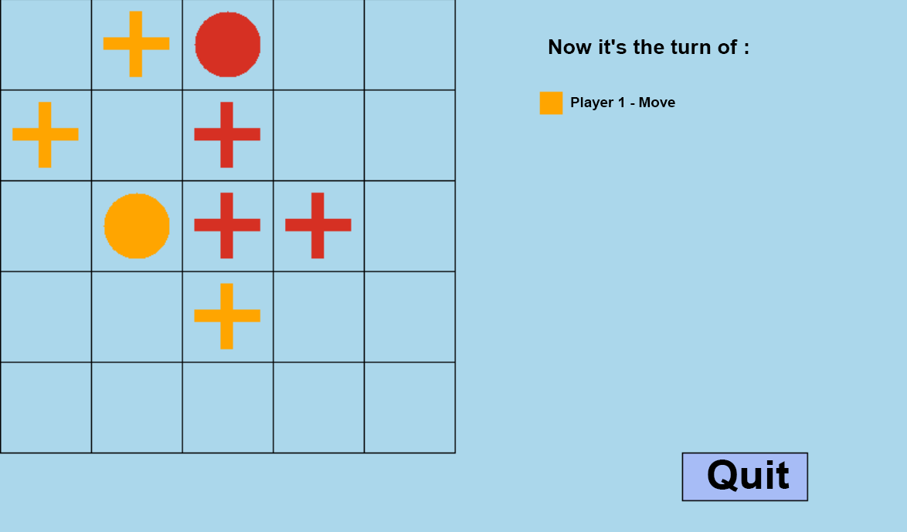

# Blocus
By **Théo Chollet** and **Tomy Da Rocha**.

## Presentation
### Number of Players
1-2 player(s)

### Objective
The goal of the game is to **block** your opponent.

### Game Setup
Selecting the game mode (1 or 2 players) and choosing the size of the grid (3×3 to 9×9).

|  |
| :--: |
| <b>Main menu</b>|

### Game Play
Player 1 starts by choosing a position in the grid, then player 2 chooses his position.

After that, the two players will alternate by choosing a **possible move** and the choice of a cell to condemn.

|  |
| :--: |
| <b>Possible Moves</b>|

### Winning

If one of the players is blocked, the victory is given to the other player.

A **pop-up** indicates victory :

|  |
| :--: |
| <b>Grid size</b>|

## Context
This project is the first one that I realized in the domain of programming. I was in a group with my classmate Tomy Da Rocha.

The goal was to produce a program written in **C89**, without any **external library** (except [the graphic library of the university](http://www.iut-fbleau.fr/sitebp/doc/doc_bib_graphique/)).
We had **2 months** to realize the program, and the provided graphic library did not allow us to work on the design easily. 
